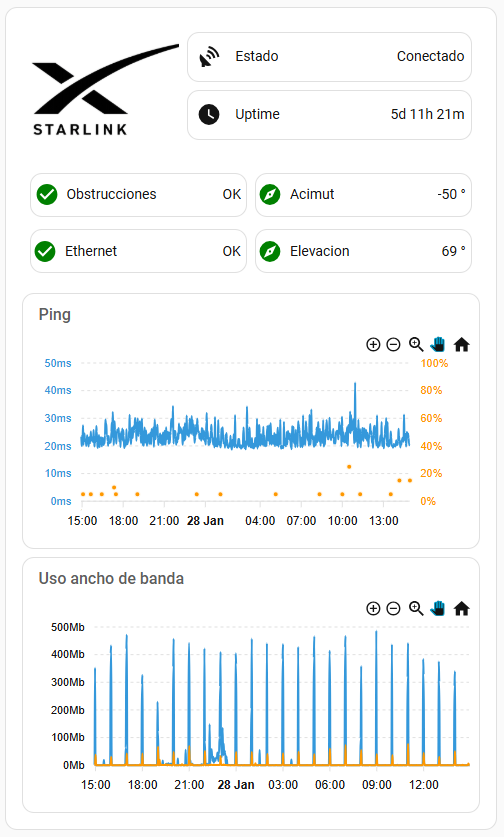

# 📡 Starlink Home Assistant Dashboard

This Home Assistant dashboard provides a comprehensive overview of Starlink system status and network performance. It displays real-time connectivity state, uptime since last restart, dish orientation parameters (azimuth and elevation) with visual validation, obstruction detection, and Ethernet link health. Additionally, it includes interactive 24-hour graphs showing network latency and packet loss, as well as uplink and downlink bandwidth usage, allowing for detailed monitoring and troubleshooting over time.

## ✨ Features

- Real-time Starlink connectivity status
- Uptime calculation since last restart
- Dish azimuth and elevation with threshold-based visual indicators
- Obstruction detection and Ethernet link health monitoring
- Interactive 24-hour graphs for latency, packet loss, and bandwidth usage

## ⚙️ Requirements

To use this Starlink Home Assistant Dashboard, make sure your environment meets the following requirements:

- **Home Assistant Core**: Version **2025.12** or later recommended.
- **HACS**: To install custom cards
- **File Editor**: To upload images
- **Starlink Integration**: Provides entities like `binary_sensor.starlink_connectivity`, `sensor.starlink_ping`, `sensor.starlink_uplink_throughput`, etc.
- **Custom Cards**: This dashboard relies on the following **custom cards**, which must be installed
    - [`button-card`](https://github.com/custom-cards/button-card)
    - [`layout-card`](https://github.com/thomasloven/lovelace-layout-card)
    - [`apexcharts-card`](https://github.com/RomRider/apexcharts-card)
    - [`hui-element`](https://github.com/thomasloven/lovelace-hui-element)
    - [`card-mod`](https://github.com/thomasloven/lovelace-card-mod)

## 🚀 Getting Started

To use this dashboard:

1. Make sure HACS and File Editor are installed.
2. Install all custom cards listed above via HACS
3. Add the Starlink Integration and ensure all entities used in the /lovelace/starlink_dashboard.yaml are available, enabled and collecting data
4. Using the File Editor, upload the file /images/starlink_logo.png to /www/images/
5. In your dashboard, add a new manual card and paste the YAML code from /lovelace/starlink_dashboard.yaml

## 👤 Author

Created and maintained by [@maikeljkwak](https://github.com/maikeljkwak)

Contributions, feedback, and suggestions are always welcome!

## 📄 License

This project is licensed under the **MIT License**.

You are free to use, modify, and distribute this dashboard, provided that the original copyright notice and license are included.

See the [LICENSE](LICENSE) file for more details.